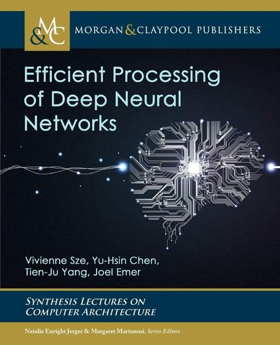

  
<h1 align="center">
  
Efficient Processing of Deep Neural Networks

  
</h1>
  

<b>Vivienne Sze · Yu-Hsin Chen · Tien-Ju Yang · Joel S. Emer 저</b> 
Morgan & Claypool · 2020년 6월 24일 출시 
[[tutorial](http://eyeriss.mit.edu/tutorial.html)]</b> 

## :bulb: 목표

- **DNN의 효율적인 처리를 가능하게 하는 기술을 익힌다.**

  > DNN accelerator를 설계하기 위한 hardware architecture 접근 방식을 이해하고, energy efficiency와 throughput을 향상시킬 방법을 공부한다.

 

## :mag: 목차

### 1. Introduction

### 2. Overview of Deep Neural Networks

### 3. Key Metrics and Design Objectives

### 4. Kernel Computation

### 5. Designing DNN Accelerators

### 6. Operation Mapping on Specialized Hardware

### 7. Reducing Precision

### 8. Exploiting Sparsity

### 9. Designing Efficient DNN Models

### 10. Advanced Technologies

### Conclusion

### Bibliography
