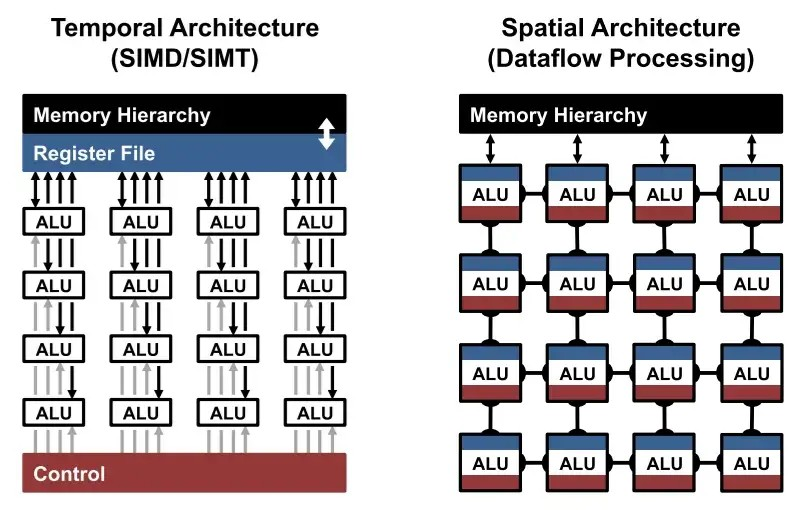
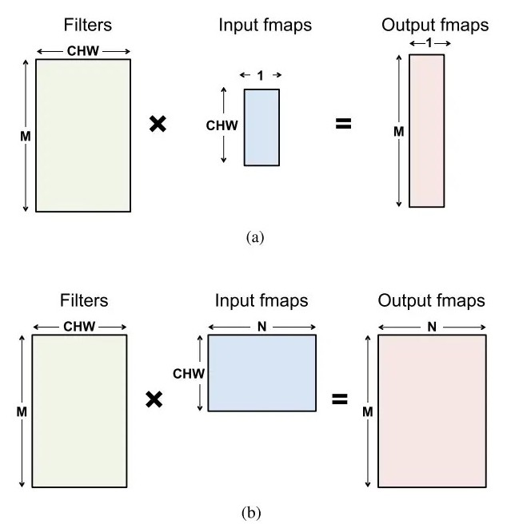
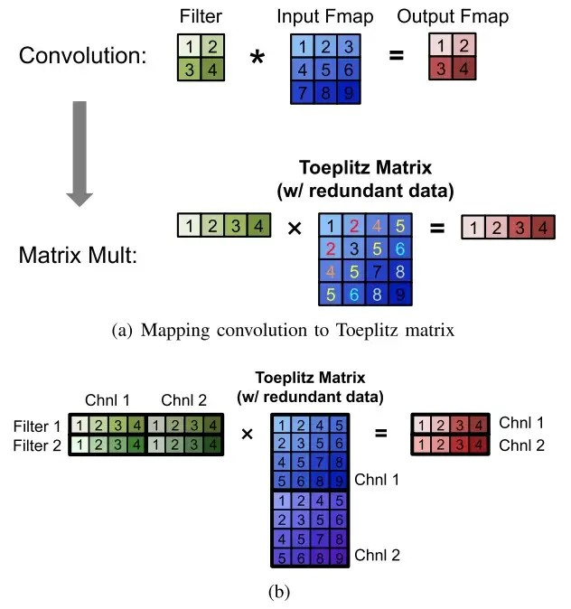
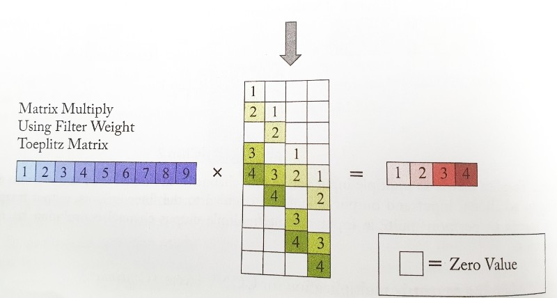
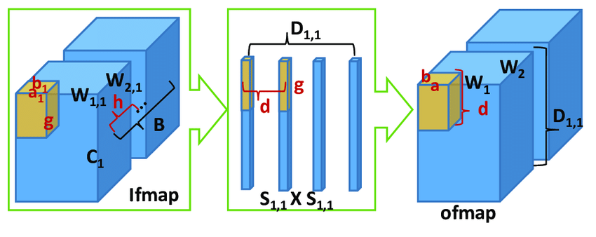
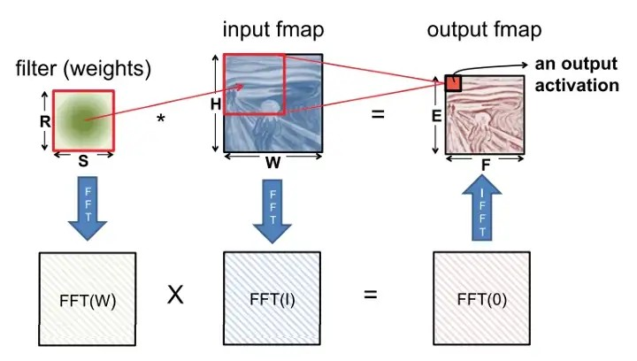

# 4 kernel computation

CONV(Convolution layer)와 FC(Fully Connected layer)는 **multiply-and-accumulate**(MAC) 연산으로 볼 수 있다. 이 말은 즉, 연산이 <U>쉽게 parallelize될 수 있음</U>을 의미한다. DNN에서 고도화된 parallel compute paradigm이 널리 쓰이는 이유이기도 하다.

> [DNN의 효율적인 training과 inference를 위한 두 가지 hardware architecture](https://heartbeat.comet.ml/the-2-types-of-hardware-architectures-for-efficient-training-and-inference-of-deep-neural-networks-a034850e26dd)

> DNN은 다양한 system에서 사용된다. 예를 들면 Nvidia나 facebook 같은 회사의 커스텀 DNN 전용 server, Nvidia Tegra나 Samsung Exynos와 같은 SoC 및 FPGA(Field-Programmable Gate Array)가 있다.

따라서 DNN의 throughput과 energy efficiency를 향상시키기 위해서는, 우선 여러 플랫폼에 따라 DNN이 어떻게 이루어지는지, 각각 어떻게 고유의 accelerator를 설계할 수 있는지 알아야 한다.

CPU와 GPU로 대표되는 temporal architecture에서는 연산을 위해 사용하는 ALU들은 보통 centralized control로 동작한다. memory hierarchy를 거쳐야만 data를 fetch할 수 있으며, direct하게 서로 communicate할 수 없다. 대신 vector instructions(SIMD)나 parallel thread(SIMT)와 같은 기술을 이용해서 parallelism을 늘려 왔다. 

반면 ASIC, FPGA based design에서 사용되는 spatial architecture는 dataflow processing을 사용한다. 다시 말해 processing chain을 형성해서 서로 communication이 가능하다. 각 ALU가 **scratchpad** 또는 **register file**이라고 불리는 자신의 contorl logic과 local memory를 갖기도 한다.

> 자기 자신의 local memory를 가진 ALU를 **processing engine**(PE)라고 지칭한다.

이렇게 서로 특성이 다르기 때문에 각자의 플랫폼에 맞춰서 다른 전략을 세워야만 DNN을 효율적으로 처리할 수 있다.

- temporal architecture(CPU, GPU)

  - kernel에서 실행되는 computational transform에서 어떻게 곱셈을 줄여서 throughput을 늘릴 수 있는지 살펴본다.

  - memory subsystem을 개선시키기 위해 어떻게 연산(예를 들면 MAC)이 order될 수 있는지(예를 들면 tiled) 살펴본다.

- accelerator로 사용하는 spatial architecture

  - memory hierarchy의 low cost memories에서, dataflow가 어떻게 data reuse를 향상시킬 수 있는지 살펴본다.

---

## 4.1 matrix multiplication with toeplitz

CPU나 GPU는 SIMD, SIMT와 같은 parallelization 기술을 이용해서 MAC 연산을 parallel로 수행했다. 이때 모든 ALU는 같은 control과 memory(register file)을 share한다. 이는 특히 matrix-matrix이나 matrix-vector 곱셈에서 효율적이다.

따라서 보통 FC나 CONV layer들은 행렬 곱셈 형태로 mapping된다.(즉, kernel 연산에 해당된다.)

- Filter matrix

  - 높이: 3차원 filter의 개수(M)

  - 폭: 3차원 filter 총 weight 수(input channel(C) 개수 \* 세로(H) \* 가로(W))

- Input fmaps(feature map)

  - 높이: 3차원 input feature map당 activation 횟수(C\*W\*H)

  - 폭: 3차원 input feature map의 수(N)

- Output fmaps₩

  - 높이: output feature map 내 channel 수(M)

  - 폭: 3차원 output feature map의 수(N)

  - FC layer의 각 output feature map은 (1, 1, M)을 가진다.

그런데 DNN의 CONV layer는 **Toeplitz matrix**의 relaxed form을 이용해서 mapping할 수도 있다. 앞선 CNN의 행렬 곱셈은 연산 과정에서 중복되는 data가 생기는 단점이 있었다. 이는 storage를 낭비하거나 memory access pattern을 복잡하게 만드는 문제를 일으킬 수 있다.

참고로 input을 filter로 convolving하는 연산은 filter를 input으로 convolving하는 연산과 수학적으로 동일하다. 따라서 다음과 같이 mapping도 가능하다.

filter size가 input feature map에 비해 훨씬 작기 때문에, 행렬 변환 시 대부분의 element가 0인 **sparse matrix**가 된다. 따라서 이런 변환은 storage면에서 비효율적이며, memory access pattern을 복잡하게 만들어 버린다.

행렬 곱셈을 optimize하는 software library으로는 CPU용(OpenBLAS, Intel MKL 등)과 GPU용(cuBLAS, cuDNN 등)이 있다. 

> 이 library들은 플랫폼에 따라 memory subsystem behavior를 조정한다.(행렬 곱셈을 storage hierarchy에 따라 tiling한다.)

이런 플랫폼의 행렬 곱셈에 transform을 적용해서 곱셈 수를 줄이는 방식으로 더욱 acceleration이 가능하다. 하지만 대체로 덧셈 연산이 늘어나고 data access pattern이 불규칙해지는 등의 다른 cost가 생겨난다.

---

## 4.2 tililng for optimizing performance

library는 compute unit과 가까운, 작고 빠르며 에너지가 덜 소모되는 memory에서 최대한 reuse가 가능할 수 있게 조절한다. 

filter와 input fmap의 inner-product 연산을 생각해 보자. filter matrix의 row 하나가, input feature map의 column 여러 개와 만나면서 차례로 output element들을 생성해 낸다. 이런 과정에서 filter matrix의 row element를 계속 reuse하게 된다.

그러나 filter matrix의 row를 compute unit과 가까운 memory(특히 cache)에 다 담을 수 없다면 성능이 좋지 못할 것이다. 이런 문제를 개선하기 위해 library는 언제나 연산에 **partition** 혹은 **tiling**을 적용해서 memory hierarchy에 맞춘다. 

이런 tiling은 recursive하게 적용하며 효율을 높일 수 있으며, 또한 multicore나 many-core에서 parallelize할 수 있다. 

하지만 tiling algorithm은 정교해야 한다. 다음 data를 연산할 때 어떤 data를 유지할지를 잘못 결정하면 cache miss와 같은 문제가 발생할 수 있다. 게다가 각 algorithm(행렬 연산 등)마다 다른 구현이 필요하며, 하드웨어 플랫폼에 알맞게 구현되어야 한다.

> 물론 이런 library 이전에 compiler에서 먼저 program을 tiling할 수 있다. GCC나 LLVM compiler가 대표적이며, algorithm을 알맞게 scheduling, tiling한다.

> 현재는 DNN에서 optimization을 해주는 TVM 같은 compiler가 존재한다. latency hiding 대신 CONV layer와 ReLU를 함께 수행하는 등의 high-level operator fusion으로 optimization을 수행한다.

> 참고로 tiling은 cache에서 일어나지 않고, 이에 특화된 buffer에서 수행된다.

---

## 4.3 computation transform optimization

DNN은 몇몇 transform을 추가하는 것으로 speedup이 가능하다.

---

### 4.3.1 Gauss' complex multiplication transform

복소수 곱셈에서 사용할 수 있는 방법으로 Gauss' technique가 있다. 

예를 들어 $(a+bi)(c+di)$ 을 연산하면 다음과 같다. 이 과정에서 4번의 곱셈과 3번의 덧셈이 수행된다.

$$ (ac - bd) + (bc-ad)i $$

그러나 다음과 같이 $k_j$ 로 $a,b,c,d$ 를 대체하게 되면, 총 3번의 곱셈과 5번의 덧셈으로 수행할 수 있다.

$$ k_1 = c(a+b) $$

$$ k_2 = a(d-c) $$

$$ k_3 = b(c+d) $$

- Real part: $k_1 - k_3$

- Imaginary part: $k_1 + k_2$

---

### 4.3.2 Strassen's matrix multiplication transform

Strassen's algorithm(슈트라센 알고리즘)은 행렬 곱셈 계산을 재귀적인 방법으로 re-association(재배치)한다. 이를 사용하면 $(n \times n)$ 크기의 두 행렬 곱셈에서 시간 복잡도를 $O(N^3)$ 에서 $O(N^{2.807})$ 로 줄일 수 있다.

> <U>큰 행렬에서 유용</U>하다. 작은 행렬일 경우 원래 계산대로 수행하는 편이 효율적이며, 아니면 더 빠른 다른 algorithm을 사용할 수 있기 때문이다.

다음 두 행렬 $A, B$ 가 있다고 하자. 두 행렬의 곱은 다음과 같다. 연산은 총 8번의 곱셈과 4번의 덧셈으로 구성된다.

$$ A = \begin{bmatrix} a & b \\ c & d  \end{bmatrix} $$

$$ B = \begin{bmatrix} e & f \\ g & h  \end{bmatrix} $$

$$ AB = \begin{bmatrix} ae+bg & af+bh \\ ce+dg & ef+dh  \end{bmatrix} $$

하지만 다음과 같이 $k_j$ 로 대체해서 연산을 수행하면, 총 7번의 곱셈과 18번의 덧셈으로 구성된다.

$$ k_1 = a(f-h) $$

$$ k_2 = (a+b)h $$

$$ k_3 = (c+d)e $$

$$ k_4 = d(g-e) $$

$$ k_5 = (a+d)(e+h) $$

$$ k_6 = (b-d)(g+h) $$

$$ k_7 = (a-c)(e+f) $$

$$ AB = \begin{bmatrix} k_5 + k_4 - k_2 + k_6 & k_1 + k_2 \\ k_3 + k_4 & k_1 + k_5 - k_3 - k_7 \end{bmatrix} $$

주의할 점은 이렇게 대체하는 과정에서 storage가 더 필요하게 된다는 점이다. 또한 때때로 numerical stability(수치 안정성)이 저하시킬 수 있다.

---

### 4.3.3 Winograd transform

Winograd's algorithm은 연산을 다르게 적용하는 방법으로 convolution 과정에서의 곱셈 수를 줄이는 데 사용한다. 

예를 들어 다음과 같이 input activation( $i_j$ ) $1\times3$ 2개와 filter weight( $f_j$ )의 multiple convolution이 있다고 하자. 총 6번의 곱셈과 4번의 덧셈이 따른다.

$$ \begin{bmatrix} i_0 & i_1 & i_2 \\ i_1 & i_2 & i_3 \end{bmatrix} \begin{bmatrix} f_0 \\ f_1 \\ f_2 \end{bmatrix} = \begin{bmatrix} o_0 \\ o_1 \end{bmatrix} $$

그러나 Winograd re-association을 적용하면 다음과 같이 대체된다. 총 4번의 곱셈과 8번의 덧셈이 수행된다.

$$ k_1 = (i_0 - i_2)f_0 $$

$$ k_2 = (i_1 + i_2){{f_0 + f_1 + f_2} \over 2} $$

$$ k_3 = (i_2 - i_1){{f_0 - f_1 + f_2} \over 2} $$

$$ k_4 = (i_1 - i_3)f_2 $$

$$ \begin{bmatrix} o_0 \\ o_1 \end{bmatrix} = \begin{bmatrix} k_1 + k_2 + k_3 \\ k_2 - k_3 - k_4 \end{bmatrix} $$

Strassen과 반대로 Winograd는 input activation이 적을 때(예를 들면 input activation의 tile)만 사용한다. 따라서 tile-by-tile인 상황에서 Winograd를 적용하며, sliding window 방식으로 계속해서 transform이 적용되게 된다.

이런 특성 때문에 Winograd는 <U>filter와 tile size를 고려해야 한다.</U> 특히 이상적인 상황에 해당되는 경우로, tile이 $2 \times 2$ 에 filter size가 $3 \times 3$ 이라면, 2.25배가량 곱셈을 감소시킬 수 있다. 

이 Winograd를 linear algebraic formulation을 다음 행렬들로 나타낼 수 있다.

$$B^{T} = \begin{bmatrix} 1 & 0 & -1 & 0 \\ 0 & 1 & 1 & 0 \\ 0 & -1 & 1 & 0 \\ 0 & 1 & 0 & -1 \end{bmatrix}$$

$$G = \begin{bmatrix} 1 & 0 & 0 \\ {1 \over 2} & {1 \over 2} & {1 \over 2} \\ {1 \over 2} & -{1 \over 2} & {1 \over 2} \\ 0 & 0 & 1 \end{bmatrix}$$

$$A^{T} = \begin{bmatrix} 1 & 1 & 1 & 0 \\ 0 & 1 & -1 & -1 \end{bmatrix}$$

- f: filter weight( $f_j$ ) 행렬은 다음과 같다.

$$f = \begin{bmatrix} f_0 \\ f_1 \\ f_2 \end{bmatrix}$$

- i: input activation( $i_j$ ) 행렬은 다음과 같다.

$$i = {\begin{bmatrix} i_0 \\ i_1 \\ i_2 \\ i_3 \end{bmatrix}}$$

- 우선 filter와 input activation에 다음 연산을 수행한다. 결과는 "Winograd" space상에 위치한다고 할 수 있다.

$$ [GfG^{T}] \odot [B^{T}iB] $$

- 마무리로 $A^{T}$ 와 $A$ 행렬을 곱하면 완성된다.

$$ Y = A^{T} \left[ [GfG^{T}] \odot [B^{T}iB] \right] A $$

---

### 4.3.4 Fast Fourier Transform(FFT)

> [Fourier Transform의 이해와 활용](https://darkpgmr.tistory.com/?page=7)

**FFT**(Fast Fourier Transform)은 **DFT**(Discrete Fourier Transform. 이산 푸리에 변환)과 그 역변환을 빠르게 수행하는 algorithm이다.

> Winograd보다 더 efficient한 다른 space로 convert하는 transform으로 이해할 수도 있다. 

다음은 곱셈을 줄이기 위해 FFT를 적용한 연산을 나타낸 그림이다.

filter와 input feature map에 FFT를 적용하고, frequency domain에서 각 원소끼리 곱한다. 이후 결과에 inverse FFT를 적용하면 output feature map을 알 수 있다.

하지만 이런 FFT는 몇 가지 결점을 가지고 있다.

- filter size에 따라 효율이 결정된다. 위 그림을 기준으로 $RS > \log_{2}{PQ}$ ( $P,Q$ 는 output size )를 만족해야만 이득이 생긴다.

- FFT size는 (보통 filter보다 클 수밖에 없는) output feature map size에 따라 결정된다.

- frequency domain으로 변환하기 때문에 complex 연산을 수행해야 한다.

- weight sparse를 이용하기 어렵게 만든다.

결과적으로 연산 자체를 줄이기는 하지만, 더 큰 storage와 bandwidth가 필요하다. 

> image 연산에서는 image가 오직 real value만 가지기 때문에 Fourier Transform이 symmetric하게 되며, storage나 computation cost를 줄일 수 있다.

---

### 4.3.5 selecting a transform

layer shape나 size에 따라 다른 algorithm을 고르면 된다.

> 주로 filter size가 $5 \times 5$ 보다 크면 FFT, $3 \times 3$ 이하면 Winograd를 사용한다.

MKL이나 cuDNN을 통해 dynamical하게 적절한 algorighm을 적용할 수 있다.

---